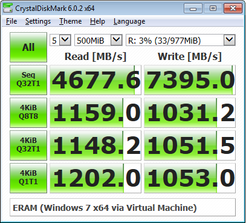
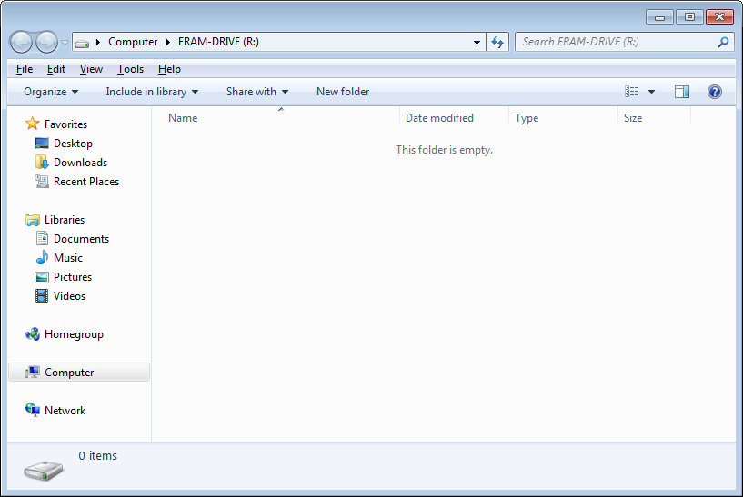
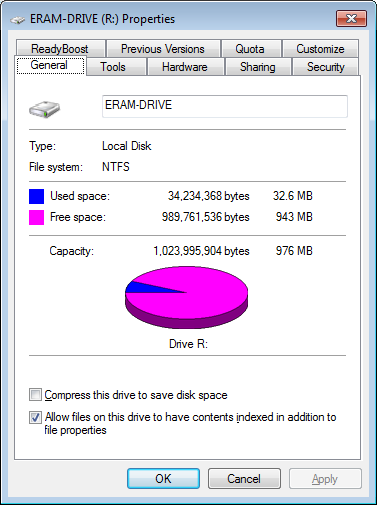
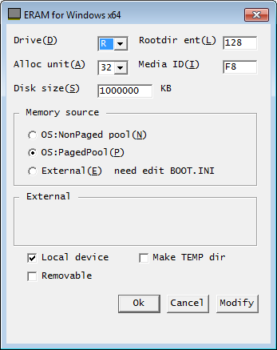

# ERAM

ERAM v2.24 is an Opensource RAM Disk made by Hideaki Okubo (okubo at msh.biglobe.ne.jp) with the source code comments translated by Katayama Hirofumi MZ (katayama.hirofumi.mz at gmail.com) and some modifications made by me thanks to help from a member of community.osr.com. It has a size limit of 4 GB that uses page/non-paged/external RAM. You can use it for storing temp files, browser cache, etc. in order to speed up the programs that use those files.

## Install Instructions

0. Download from the Releases section (available at https://github.com/Zero3K/ERAM/releases)

x86 (32-bit)
------------
1. Run the `ERAM_x86.exe`.
2. Follow the instructions.

x64 (64-bit)
------------
1. Run the `ERAM_x64.exe`
(you might have to run the Installer with Driver Signature Enforcement Disabled for it to install without any errors).
2. Follow the instructions.

After installing, the RAM Disk will be available as the R: or Z: drive with a size of 1 GB (for 32-bit OSes) and 4 GB (for 64-bit OSes) which can be changed as you see fit by running `eram.cpl` by pressing <kbd>Win</kbd> + <kbd>R</kbd>.

## Build Instructions

1. Download WDK (Windows Driver Kit) 7.1.0 from https://www.microsoft.com/en-us/download/details.aspx?id=11800.
2. Extract the ISO using 7-Zip, etc. to a directory of your choosing.
3. Run the KitSetup.exe located in the directory it was extracted to.
4. Click Full Development Environment.
5. Click OK.
6. After the install has completed, you can find the Build Environments in the Start Menu in Windows Driver Kits\WDK 7600.16385.1\Build Environments.
7. Open the proper Environment depending on what OS and CPU architecture you are building for (Only the Checked Build Environment works for now).
8. Change the directory to the location of the source code (for example, cd C:\ERAM).
9. Type build and press Enter.

## Benchmarks

## Screenshots

## Original Developer's Website

http://www.vector.co.jp/authors/VA000363
